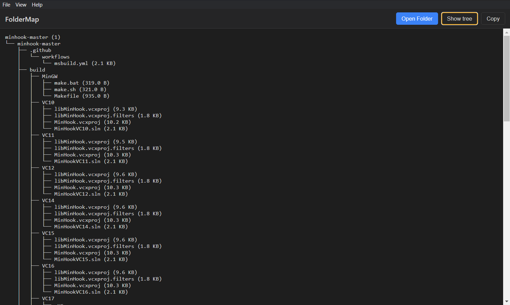

**FolderMaster**

A tool that automatically creates interactive tree diagrams from your folder structure which can be turned to text.

**Features**

Visualize any folder as an interactive tree

See file and folder sizes

Expand/collapse folders

Export the folder structure as text

**Example Structure**

Installation:

Clone the repository and build it in terminal:

git clone `https://github.com/deeemx/FolderMaster`

Or download the .exe file from the releases
 section.
MADE THIS FOR SCHOOL
